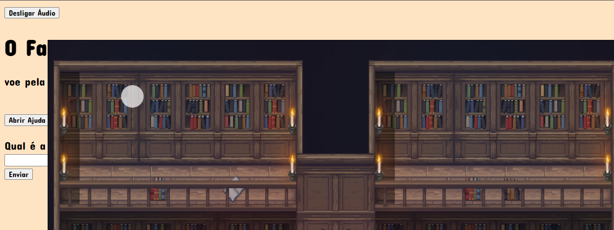

# O FANTASMA DETETIVE
☑️JOGO EM HTML/CSS/JS.

 <br> 

## DESCRIÇÃO:
O objetivo do jogo "O Fantasma Detetive" é ajudar o jogador, que controla um fantasminha, a encontrar pistas escondidas em uma biblioteca antiga. Essas pistas são necessárias para descobrir a resposta certa e resolver o mistério do jogo.

Aqui estão as principais mecânicas e objetivos do jogo:

1. **Exploração da Biblioteca:** O jogador deve explorar o ambiente misterioso da biblioteca em busca de pistas. Isso envolve mover o fantasminha pela tela usando as teclas de seta no teclado.

2. **Encontrar e Interagir com Objetos:** Ao longo da biblioteca, o jogador encontrará vários objetos e itens. Alguns desses objetos contêm pistas escondidas. Quando o jogador encontra um desses objetos, ele pode pressionar a tecla "Enter" para revelar a pista contida nele.

3. **Resolver Enigmas e Descobrir a Resposta Certa:** As pistas encontradas ajudarão o jogador a resolver enigmas e descobrir a resposta certa para o mistério do jogo. A resposta certa é revelada no final do jogo.

4. **Evitar Obstáculos:** Durante a exploração da biblioteca, o jogador deve evitar obstáculos que possam atrapalhar sua busca por pistas.

5. **Divertir-se e Boa Sorte:** O jogo também encoraja o jogador a se divertir enquanto procura por pistas e resolve enigmas. A sorte também é um fator importante, já que algumas pistas podem ser mais difíceis de encontrar do que outras.

## COMO USAR?
* Clone o repositório para o seu sistema local:

```bash
git clone https://github.com/VILHALVA/O-FANTASMA-DETETIVE.git
```

* Navegue até o diretório do projeto.

```bash
cd O-FANTASMA-DETETIVE
```

* Descompacte o arquivo ZIP (se você baixou manualmente):

```bash
unzip O-FANTASMA-DETETIVE.zip
```
* Abra o arquivo `index.html` em seu navegador de preferência.

## NÃO SABE?
- Entendemos que para manipular arquivos em `HTML`, `CSS` e outras linguagens relacionadas, é necessário possuir conhecimento nessas áreas. Para auxiliar nesse aprendizado, oferecemos cursos gratuitos disponíveis:
* [Curso de HTML e CSS](https://github.com/VILHALVA/CURSO-DE-HTML-E-CSS)
* [Curso de JavaScript](https://github.com/VILHALVA/CURSO-DE-JAVASCRIPT)
* [Confira mais cursos](https://github.com/VILHALVA?tab=repositories&q=+topic:CURSO)

## CREDITOS:
- [PROJETO CRIADO PELO "proxygo"](https://github.com/proxygo/O-fantasma-Detetive)
- [PROJETO EDITADO PELO VILHALVA](https://github.com/VILHALVA)
- [ESTÁ DISPONIVEL NO SITE](https://vilhalva.github.io/STYLER/STYLER.html)